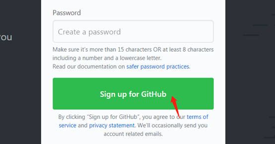
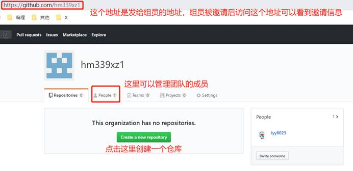

# 项目实战之组长搭建GitHub环境

## 1.导入项目

### 1.1   准备项目

​	准备一个功能比较全的项目，作为本组成员的初始项目。

​	所有组员共用同一个初始项目，避免后期整合到一起的时候出现问题。


​		这个项目，组长可以直接拿讲师最后一天的项目，发给组员们，务必保证所有人初始共用同一个项目。

### 1.2 把项目导入idea

​	退出之前项目的开发，idea-File-close Project。然后在idea初始页面选择导入项目。


​	一路**下一步**，把项目导入到idea里。

​	项目导入完后，**在idea的setting里将maven仓库修改成你自己的品优购的仓库。**

## 2.idea中配置git


## 3.GitHub的使用

### 3.1 GitHub账号注册

​	登录[github.com]()，注册一个账号。



### 3.2 登录

​	将信息填写完毕后，点击注册即可，需要在邮箱中进行验证，用户验证完后就可以在https://github.com/login进行登录了，登录后界面：

### 

### 3.3 创建开发小组

账号创建完毕后是下图的页面。在右上角找到“+”号，选择“New organization”创建一个开发小组。


 

给小组起名：


 

邀请组员进组，可以在这里邀请，也可以后面在组里邀请组员，此步不急可略过。


 

第3步：跳过就行了。


### 3.4 管理开发小组



​	创建一个仓库，用来共同开发品优购项目。


创建完毕后的小组是这样的。


接下来可以邀请组员进组了


​	选择会员和所有者都可以。


### 3.5 在idea中配置GitHub账号相关信息


test测试能不能通过，必须联网。

### 3.5 IDEA将代码推送至远程GitHub仓库

#### 3.5.1 在项目根路径（parent文件夹）下添加.gitignore文件


​	文件内容：

```
# Created by .ignore support plugin (hsz.mobi)
### Example user template template
### Example user template

# IntelliJ project files

.idea
*.iml
out
gen
.classpath
*.eml
target
*.log
*.log.*
generatorConfig.xml
.DS_Store
*.cache
*.lock
Test*.java
```

```java

```

#### 3.5.2 创建本地git仓库


#### 3.5.3 git add操作


​	**add完以后，所有图标变绿。**


#### 3.5.4 git commit操作

​	

​	


​	此过程时间较久，建议耐心等待。

​	

​	

​	**出现上面的俩窗口，无视，直接commit。**

#### 3.5.5 git push操作

​	

​	

​	

​	成功以后查看github，发下项目已经导入成功。

​	

​	现在可以把项目路径分享给组员供组员拉取了。

​	

# 项目实战之组员拉取项目

## 1.准备工作

​	安装Git，Tortoisgit。

​	注册github账号，参考组长。

## 2.配置idea中git和github设置

### 2.1 修改idea初始设置

​	退出当前项目到初始界面，File-close Project。然后在初始界面选择Configure-Settings。


### 2.2 配置git

​	

### 2.3 配置github账号信息

​	

### 2.4 配置maven仓库


​		

​										**配置结束后，点OK或者Apply让你的修改生效。**


## 3.从github上拉取项目

### 3.1 在初始界面选择从git导入项目。


​	配置完成之后clone 会出现此界面

​		


​	

​	然后一直点下一步，最后完成即可

​	


## 4.修改某个文件

​	修改项目中有的文件，比如向BrandController里加一个main方法。


### 4.1 git - add

先进行add，选择项目点击git或者选中文件点击git，然后add。

​	

### 4.2 git - commit

​	然后进行commit ，选择项目点击git或者选中文件点击git，commit。

​	

​	

​	

​	

### 4.3 git - push

​	push到github上

​	

​	

​	然后点击push即可，出现下面的框框说明push成功，push完成后可以去github看看有无改动。

​	